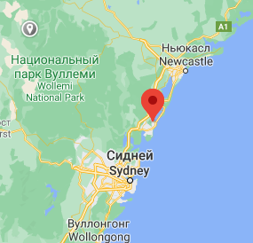

# Задание 3

33.357778S, 151.442750E -- JCRV+V3 Беркли Вейл, Нов. Юж. Уэльс, Австралия

33°21'28.0" южной широты, 151°26'33.9" восточной долготы

Координаты WGS 84 '-33.357778, 151.442750'

[Вернуться](index.md)
